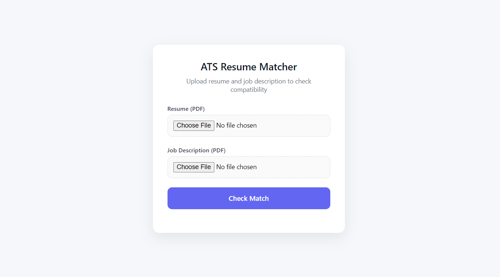

# ATS Resume Matcher

Welcome to the **ATS Resume Matcher**! This project is a web application built with Python and Flask that allows users to check their resume's compatibility score with job descriptions using an Applicant Tracking System (ATS) algorithm.

## Features
- User-friendly web interface
- Upload your resume and job description
- Get instant ATS compatibility score
- Machine learning powered analysis
- Easy to use and extend

## Project Structure
```
project1/
│   app.py           # Main Flask application
│   req.txt          # Python dependencies
└───templates/
    │   home.html    # Main HTML template
```

## Getting Started

### 1. Clone the Repository
```bash
git clone <your-repo-url>
cd project1
```

### 2. Install Dependencies
Make sure you have Python 3.7+ installed.

```bash
pip install -r req.txt
```

### 3. Run the Application
```bash
python app.py
```

The app will be available at [http://127.0.0.1:5000](http://127.0.0.1:5000).

## Screenshots
To add screenshots of your application:
1. Take a screenshot and save it in the `templates/` folder (or another folder in your project).
2. Reference the image below using the correct path:

```markdown

```

Replace `templates/home.png` with your actual screenshot filename and path.


## License
[MIT](LICENSE)
